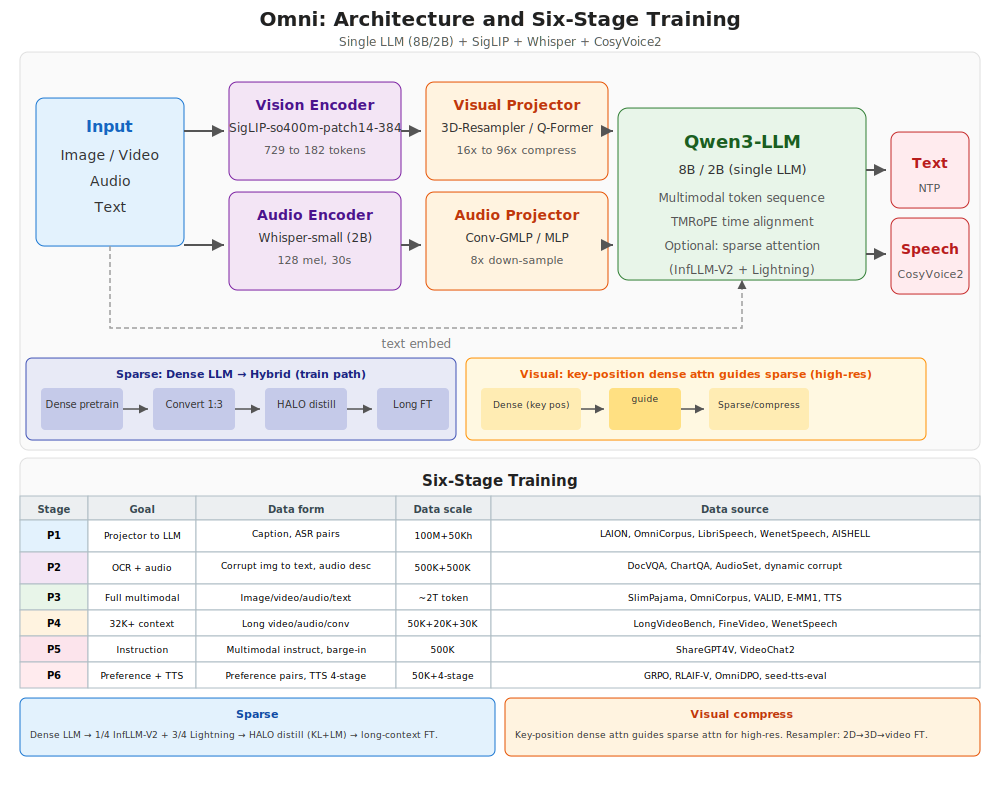
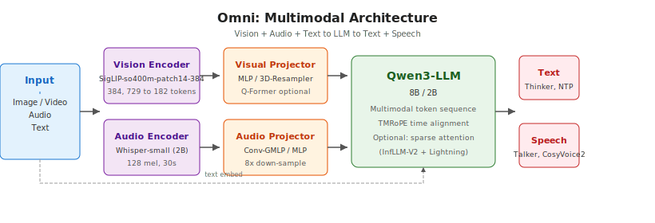
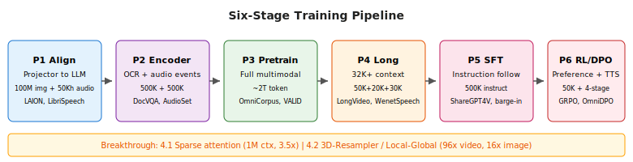
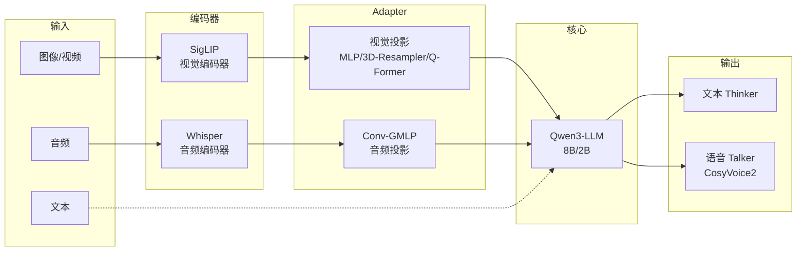

# Omni 全模态模型训练方案 — 1 页 PPT 概要

> 基于 Qwen3-LLM (8B/2B) + SigLIP-so400m-patch14-384 + Whisper-small + CosyVoice2 架构

---

## 一、模型架构图

**图1 单张完整图（架构 + 六阶段表格，每阶段含数据量/来源/GPU 时间）** — 全英文，无编码错误

- 上图：Input → Vision/Audio Encoder → Projector → Qwen3-LLM → Text/Speech；单线流，与 OpenOmni/Baichuan-Omni 风格一致。
- 下表：Stage、Goal、Data form、**Data scale**、**Data source**、**GPU/Time**，六阶段每行都有数据量、来源、GPU 与时间说明。

**图2 仅架构**（纯数据流，无表格）

**图3 仅训练流程**（六阶段横向，每格含数据规模与来源缩写）

> 三张图均为纯英文，避免浏览器/查看器编码报错；中文说明见本页下方表格与正文。

Mermaid 架构图（可复制到支持 Mermaid 的编辑器中编辑）

---

## 二、核心组件与 Adapter 选型

| 组件 | 选型 | 说明 |
|------|------|------|
| **视觉编码器** | SigLIP-so400m-patch14-384 | 384×384 输入，729→182 tokens（2×2 Mean Pool） |
| **音频编码器** | Whisper-small (2B) | 128 mel 频谱，30s 音频，跨语言 ASR |
| **LLM 骨干** | Qwen3-8B/2B | 多模态 token 序列，TMRoPE 时间对齐 |
| **语音解码器** | CosyVoice2 | 流式语音生成，Thinker-Talker 双轨 |

### Adapter 三种方案对比

| 方案 | 压缩率 | 复杂度 | 适用场景 |
|------|--------|--------|----------|
| **MLP（2 层）** | 1×（仅对齐） | 最低 | 快速原型、资源有限 |
| **3D-Resampler** | 视频 96× / 图像 16× | 中等 | 长视频、高分辨率、追求效率 |
| **Q-Former** | 可学习查询 | 较高 | 需可学习 query 的跨模态对齐 |

**推荐**：视觉用 MLP 或 3D-Resampler；音频用 **Conv-GMLP**（8× 下采样，ASR 仅降 0.3%）。

---

## 三、六阶段训练流程

| 阶段 | 目标 | 冻结/训练 | 数据形式 | 数据量 | 数据来源 |
|------|------|-----------|----------|--------|----------|
| **P1 对齐** | 投影器对齐到 LLM 空间 | 冻 LLM+编码器，训投影器 | 图文 caption、音文 ASR | 100M 图文 + 50Kh 音文 | LAION-5B、OmniCorpus、LibriSpeech、WenetSpeech、AISHELL |
| **P2 编码器微调** | OCR、音频事件增强 | 冻 LLM，训投影+编码器 | 损坏图→原文、音频描述 | 500K OCR + 50 万音频事件 | DocVQA、ChartQA、InfoVQA、动态损坏合成、AudioSet、MusicCaps |
| **P3 联合预训练** | 全模态理解 | 全参数 | 图文交错、视频-文、音-文、跨模态 | ~2T token | SlimPajama、OmniCorpus、VALID、FineVideo、E-MM1、TTS 合成 |
| **P4 长上下文** | 32K+ 上下文 | 全参数 | 长视频、长音频、长对话 | 50K 长视频 + 20K 长音频 | LongVideoBench、FineVideo、WenetSpeech 长段 |
| **P5 SFT** | 指令遵循 | 全参数 | 多模态指令对话 | 500K 条 | ShareGPT4V、VideoChat2、打断/续说样本 |
| **P6 RL/DPO** | 偏好、语音质量 | 全参数 | 偏好对、语音偏好 | 50K 偏好 + Talker 四阶段 | GRPO、RLAIF-V、OmniDPO、seed-tts-eval |

**数据混合（P3）**：纯文本 40% + 图文 25% + 视频 15% + 音频 10% + 跨模态 10%；渐进式：先图文→加视频→加音频→全模态。

---

## 四、突破方向（4.1–4.2）

### 4.1 稀疏注意力支持更长上下文

- **目标**：1M token 上下文，256K 下 3.5× 推理加速，训练成本降约 75%
- **方案**：25% InfLLM-V2 稀疏 + 75% Lightning 线性注意力（1:3 混合）
- **路径**：Transformer-to-hybrid，HALO 蒸馏，HyPE 混合位置编码

### 4.2 更大视觉分辨率与 token 压缩

- **目标**：视频 96× 压缩（6 帧 448×448 → 64 tokens），支持 896×896+ 不爆显存
- **方案 A**：3D-Resampler（MiniCPM-V 4.5）— 时空联合交叉注意力
- **方案 B**：Local-Global Attention Pooling（Ola）— 2× 压缩，信息损失更小

---

## 五、资源估算（8B / 2B 模型）

| 阶段 | GPU | 时间 | 总 GPU 小时 |
|------|-----|------|-------------|
| P1–P2 | 8× A100 80G | 5–8 天 | ~1,300 |
| P3 | 32× A100 80G | 2–3 周 | ~16,000 |
| P4–P6 | 8–16× A100 | 10–15 天 | ~3,300 |
| **合计** | | **约 4–5 周** | **~20,600** |

---

*架构图见 `omni_architecture.svg`，详细方案见 `Doc/草稿/08_Omni模型训练方案.md`*
